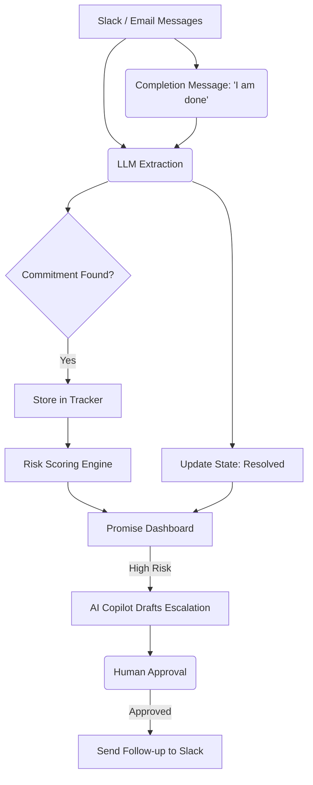

# Promise

**Promises are made. Promises are lost. Promise finds them.**

Promise is an intelligent operations radar that connects to your Slack and Email to automatically track informal work commitments. It extracts promises like *"I'll have the deck by Friday"*, tracks their deadlines, scores their risk of slipping, and provides an AI Copilot to help you escalate and follow up before things go wrong.

---

## Features

- **Automated Extraction:** Uses LLMs (OpenAI `gpt-4o`) to continuously scan Slack and email conversations, identifying genuine actionable commitments without manual data entry.
- **Dynamic Risk Radar:** Every commitment receives a 0-100 risk score based on deadline proximity, inactivity, and urgency phrasing. 
- **AI Copilot Escalation:** When a commitment turns critical, the AI Copilot drafts context-aware follow-up messages. A human-in-the-loop (HITL) system ensures you always approve the message before it sends.
- **Real-Time Resolution:** Connect a live Slack webhook. When a team member posts *"I'm done"*, Promise catches it, links it to the commitment, and drops the risk score to zero instantly.
- **Light & Dark Mode:** A sleek, ops-monitoring aesthetic built for rapid scanning.

---

## How It Works



---

## Setup & Run Locally

### Requirements
- Node.js 18.17 or newer
- npm
- An OpenAI API Key (`OPENAI_API_KEY`)

### 1. Install and Start
```bash
npm install
npm run dev
```
Open [http://localhost:3000](http://localhost:3000).

### 2. Environment Variables
Create a `.env.local` file in the root directory:
```bash
OPENAI_API_KEY=sk-... 
SLACK_WEBHOOK_URL=https://hooks.slack.com/services/... # For sending escalations
```
*(If `SLACK_WEBHOOK_URL` is omitted, the app defaults to a safe demo mode that logs escalations to the console instead of sending them).*

---

## Live Slack Webhook Integration (Optional)

You can connect Promise directly to a real Slack workspace to test real-time commitment resolutions.

### 1. Expose your Localhost
Run `ngrok` to expose your development server to the internet:
```bash
ngrok http 3000
```
*Copy the `https://xxxx.ngrok-free.app` URL.*

### 2. Create a Slack App
1. Go to [api.slack.com/apps](https://api.slack.com/apps) and click **Create New App** > **From scratch**.
2. Give it a name (e.g., "Promise") and select your workspace.

### 3. Configure Event Subscriptions
1. Click **Event Subscriptions** on the left sidebar and toggle "Enable Events" to **On**.
2. In the **Request URL** field, paste your ngrok URL with `/api/slack/events`:
   ```
   https://YOUR_NGROK_URL.ngrok-free.app/api/slack/events
   ```
   *(Slack will verify the URL immediately).*
3. Under **Subscribe to bot events**, click **Add Bot User Event**, and add `message.channels`.
4. Click **Save Changes**.

### 4. Install the App
1. You will see a yellow banner asking you to reinstall the app. Go to **Install App** and click **Reinstall to Workspace**.
2. Go to any public channel in your Slack workspace and invite the bot (e.g., `@Promise`).

### 5. Test It
Send a message in the channel like: *"I'll have the marketing report done by tomorrow afternoon."*
The Promise dashboard will update in real-time, parsing your Slack message and adding it to the radar! When you reply *"I finished the report"*, it will automatically mark it as **Resolved**.

---

## Architecture Highlights
- **Framework:** Next.js 14 App Router
- **UI:** TailwindCSS + `next-themes` + Lucide React
- **AI Agent:** CopilotKit for side-car conversational AI and HITL capabilities.
- **State:** In-memory store backed by localized JSON files (`seed-slack.json`). Designed for low-latency demonstration without requiring heavy Postgres setups.

## Team

- Maazin Kazi
- Mohammad Ahmad
