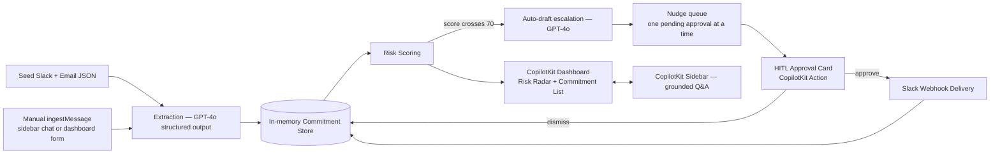

# Promise

Promise turns the deadlines people casually promise in Slack and email into tracked, scored, escalating commitments — with a human always in the loop before anything gets sent.

## The problem

Deadlines don't die in project trackers — they die quietly in Slack threads and email chains. Someone says *"I'll get this to you by Friday"* or *"let's push launch a week,"* and unless someone manually logs it, that commitment never becomes a tracked deadline. By the time it's missed, there's no paper trail, just surprise.

## What Promise does

This is the real, verified loop, end to end:

1. **Extraction** — seed Slack + email messages (and anything manually ingested) are sent to `gpt-4o` in a single structured-output call. It pulls out `{owner, description, dueDate, confidence, sourceExcerpt}` for every genuine commitment, resolves relative dates ("by Friday") against each message's own timestamp, discards non-commitments outright, and also flags when a later message indicates an earlier commitment was already finished.
2. **Risk scoring** — a deterministic 0–100 score per commitment, combining deadline proximity, days of inactivity, and urgency language in the source text. No LLM call needed for this step.
3. **Auto-flagging** — on every clock advance or recompute, any commitment that crosses a risk score of 70 is automatically flagged **and** drafted — no manual click required to notice risk.
4. **Escalation drafting** — a second `gpt-4o` call writes a short, specific escalation message referencing the actual due date and the actual reason it's at risk (not a generic reminder).
5. **Human-in-the-loop approval** — the draft surfaces as an editable card inside the CopilotKit sidebar. A human can edit the text, approve it, or dismiss the flag. Nothing sends without that click.
6. **Slack delivery** — on approval, the message goes out through a Slack Incoming Webhook. If no webhook is configured, it's safely logged in an in-app demo log instead — the flow never breaks either way.
7. **Manual ingestion** — a message that isn't in the seed data can be added live, either by telling the sidebar ("ingest this Slack message: ...") or through a small form on the dashboard. It runs through the same extraction step and, if it's a real commitment, joins the tracked list immediately.
8. **Conversational grounding** — the sidebar can also just answer questions like "what's my riskiest commitment right now?", grounded in the actual live state, not a canned response.

**Exa enrichment is not built.** `lib/exa.ts` doesn't exist, there's no Exa dependency in `package.json`, and `EXA_API_KEY` is accepted but unused — it was part of the original plan, not something currently wired in.

## Why this fits "Agents leaving the chatbox"

The CopilotKit dashboard and sidebar are the actual product surface, not a chat window bolted onto an existing app — the risk radar, the escalation card, and the approval step all live there natively. Slack is real delivery, not a mock: an approved message is a genuine `fetch` to an Incoming Webhook, landing in an actual channel. The environment (the dashboard people would actually watch, and the channel people would actually read) is where the agent acts, not a decorative wrapper around an LLM call.

## Architecture



The nudge queue exists because CopilotKit's underlying protocol won't accept a new chat message while a previous tool call (an open approval card) hasn't been resolved — so when more than one commitment flags at once, only one approval card is nudged into the sidebar at a time, and the rest wait their turn. See **Known limitations** below for the one edge case in this queue that isn't fully fixed yet.

> **Note on scope:** the codebase also contains a live Slack Events API endpoint (`app/api/slack/events/route.ts`) that receives real Slack messages and writes them to `data/seed-slack.json` on disk. This isn't reflected in the diagram above because it conflicts with [ARCHITECTURE.md](./ARCHITECTURE.md)'s own locked decision against live Slack/email OAuth ingestion and against writing to the seed files — flagging it here for the team rather than presenting it as an intended part of the design.

## Tech stack

Only dependencies actually present in `package.json`:

| Layer | Choice |
|---|---|
| Framework | Next.js 14 (App Router) + TypeScript |
| Agent UI | **CopilotKit** (`@copilotkit/react-core`, `@copilotkit/react-ui`, `@copilotkit/runtime`) — sidebar, dashboard actions, generative UI, HITL approval |
| LLM | **OpenAI** (`openai`) — `gpt-4o` for extraction and escalation drafting |
| Validation | `zod` — structured-output schema for extraction |
| Styling | Tailwind CSS, `next-themes` (light/dark toggle), `lucide-react` (icons) |
| Data layer | In-memory store (`lib/store.ts`) — no database |
| Delivery | Slack Incoming Webhook (plain `fetch`, no SDK) |

**Sponsor integrations actually wired in:** CopilotKit and OpenAI. Exa is not implemented (see above). No Auth0, Trigger.dev, or OpenRouter integration exists in this codebase.

## Quickstart

```bash
git clone <this-repo>
cd Promise-1.0
npm install
cp .env.example .env.local
```

Fill in `.env.local`:

| Variable | Required | If unset |
|---|---|---|
| `OPENAI_API_KEY` | Yes | Extraction and drafting hard-fail; the app falls back to a small set of hardcoded demo commitments and template escalation text instead of crashing. |
| `EXA_API_KEY` | No | No effect — nothing reads it yet. |
| `SLACK_WEBHOOK_URL` | No | Approved escalations are logged in-app in demo mode instead of being sent — nothing crashes. |

```bash
npm run dev
```

Open [http://localhost:3000](http://localhost:3000). (The CopilotKit provider currently points at a hardcoded `http://localhost:3000/api/copilotkit` — see Known limitations if you run on a different port.)

## Demo walkthrough

1. Open the dashboard — commitments extracted live from the seed data, all calm.
2. Click **Simulate 3 days passing**. Watch at least one commitment's risk cross into the red zone.
3. An escalation card appears in the sidebar automatically — no manual "draft" click needed. The text is a real `gpt-4o` response, not a template.
4. Review (edit if you like) and click **Approve & send**.
5. Check your Slack channel for the message, or the in-app demo log if `SLACK_WEBHOOK_URL` isn't set.
6. Ask the sidebar something like *"what's my riskiest commitment right now?"* and get an answer grounded in the live state.
7. Optionally, try the **Manually ingest a message** form on the dashboard (or ask the sidebar to ingest a message you paste in) and watch a brand-new commitment appear.

## Project docs

- [ARCHITECTURE.md](./ARCHITECTURE.md) — locked decisions, non-negotiables, what to cut if time runs short
- [DATA_SPEC.md](./DATA_SPEC.md) — canonical data model, seed shape, risk scoring formula
- [BUILD_PLAN.md](./BUILD_PLAN.md) — phased build checklist against the hackathon time budget
- [FAILURES.md](./FAILURES.md) — real issues hit during the build and how they were fixed
- [TESTING.md](./TESTING.md) — manual smoke-test checklist
- [context.md](./context.md) — original project spec

## Team

- Maazin Kazi
- Mohammad Ahmad
