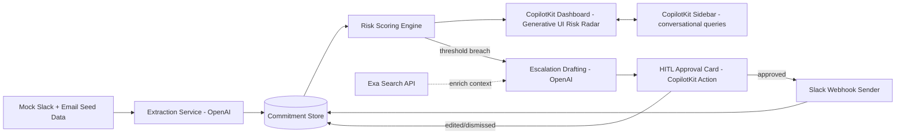

# Promise — Project Context

> This file is the single source of truth for any LLM or coding agent (Claude Code, Cursor, etc.) working on this project. Read this in full before writing code. Keep it updated if scope changes during the build.

## Hackathon Theme

"Agents leaving the chatbox" — build an agent for a place people already work, talk, or live, and make the environment essential, not decorative. Judged on: Core Requirements & Functionality, Innovation & Theme Alignment, Technical Execution & Integration, Usefulness & Agentic Experience. This project also targets the **Best Use of CopilotKit** sponsor award.

## Problem Statement

Deadlines don't die in project trackers — they die quietly in Slack threads and email chains. Someone says *"I'll get this to you by Friday"* or *"let's push launch a week"*, and unless someone manually logs it, that commitment never becomes a tracked deadline. By the time it's missed, there's no paper trail, just surprise.

**Deadline Radar** is an agent that lives where those commitments are actually made — Slack and email — continuously extracting them, scoring how likely each one is to slip, and when risk crosses a threshold, drafting the actual escalation message needed to fix it. A human always approves before anything is sent. The whole thing is visualized live on a CopilotKit-powered dashboard, not buried in a chat log.

The agent isn't a reminder tool. It's the missing layer between "someone said something in chat" and "someone actually acted on it."

## User Flow

1. **Seed ingestion** — mock Slack channel history + mock email thread history are loaded (`/data/seed-slack.json`, `/data/seed-email.json`). No live OAuth in the demo path — this is intentional, for reliability.
2. **Commitment extraction** — each message is passed to GPT-4o with a structured-output schema; the model extracts `{owner, description, dueDate, confidence, sourceExcerpt}` for any message containing a real commitment. Non-commitment messages are discarded.
3. **Risk scoring** — a scoring function combines days-remaining, time-since-last-related-activity, and urgency/sentiment signals from the source text into a 0–100 risk score per commitment.
4. **Dashboard render** — the CopilotKit UI reads commitment state (`useCopilotReadable`) and renders a live Risk Radar (generative UI: color-coded by score) plus a commitment list.
5. **Demo trigger** — a "simulate time passing" button advances the mock clock, causing at least one commitment's risk to spike into the red zone live, on stage.
6. **Escalation drafting** — when a commitment crosses the risk threshold, GPT-4o drafts a specific, context-aware escalation message (not a generic reminder) and the agent surfaces it as an `EscalationCard` via generative UI.
7. **Human-in-the-loop approval** — the user can approve, edit, or dismiss the draft (`useCopilotAction` with a HITL render). Nothing is sent without explicit approval.
8. **Delivery** — on approval, the message is sent via a Slack **Incoming Webhook** (single URL, no OAuth — real delivery without the fragility of a full Slack app install) and the commitment's status updates to `escalated`.
9. **Optional enrichment** — if a commitment references an external resource ("send them the updated pricing page"), Exa search fetches current relevant content to fold into the escalation draft.
10. **Conversational grounding** — the user can also just ask the CopilotKit sidebar "what's my riskiest deadline right now?" and get an answer grounded in live state, not a generic response.

## Tech Stack (sponsor integrations marked)

| Layer | Choice | Notes |
|---|---|---|
| Frontend framework | Next.js 14 (App Router) + TypeScript | |
| Agent UI framework | **CopilotKit** (sponsor) | `CopilotSidebar`, `useCopilotReadable`, `useCopilotAction`, generative UI, HITL render |
| LLM | **OpenAI API** (sponsor) — `gpt-4o` | Structured outputs for extraction; standard completion for escalation drafting |
| Web enrichment | **Exa API** (sponsor) | Neural search to enrich escalation drafts with current external context |
| Styling | Tailwind CSS + shadcn/ui | |
| Data layer | In-memory store or `lowdb` JSON file | Speed over durability — this is a demo, not production |
| Real delivery channel | Slack Incoming Webhook | One POST call, no OAuth flow — safe to use live in the demo |
| Deployment | Local dev server for the demo; Vercel if time allows | |

**Environment variables needed:** `OPENAI_API_KEY`, `EXA_API_KEY`, `SLACK_WEBHOOK_URL` (optional — falls back to an in-app "sent" log if unset, so the demo never depends on Slack being reachable).

## Architecture



## Data Model

```ts
type Commitment = {
  id: string;
  sourceType: "slack" | "email";
  sourceExcerpt: string;
  owner: string;
  description: string;
  dueDate: string; // ISO date
  lastActivityAt: string; // ISO date
  riskScore: number; // 0-100
  status: "tracked" | "flagged" | "escalated" | "resolved";
  escalationDraft?: string;
};
```

## CopilotKit Actions (contract)

- `extractCommitments(sourceBatch)` → runs extraction over new seed messages, returns `Commitment[]`
- `recomputeRisk()` → recalculates `riskScore` for all tracked commitments (called on mock-clock advance)
- `draftEscalation(commitmentId)` → generates `escalationDraft`, sets status to `flagged`, surfaces `EscalationCard`
- `approveEscalation(commitmentId, editedText?)` → **HITL-gated** — sends via Slack webhook (or logs if unset), sets status to `escalated`
- `dismissFlag(commitmentId)` → resets status to `tracked`

## Component Breakdown

```
/app
  /api/copilotkit/route.ts   — CopilotKit runtime endpoint, registers all actions above
  page.tsx                   — main dashboard route
/components
  RiskRadar.tsx               — generative UI: color-coded live risk visualization
  CommitmentList.tsx          — table/list of tracked commitments
  EscalationCard.tsx          — HITL approve/edit/dismiss card
/lib
  extraction.ts               — OpenAI structured-output extraction logic
  scoring.ts                  — risk scoring function
  exa.ts                      — Exa enrichment wrapper
  slack.ts                    — webhook sender (no-op fallback if unset)
  store.ts                    — in-memory/lowdb data layer
/data
  seed-slack.json
  seed-email.json
```

## Demo Script (for the 2-minute video)

1. Open the dashboard — a handful of tracked commitments, all calm/green.
2. Hit "simulate time passing" — one commitment's risk spikes red live on the radar.
3. The agent auto-drafts an escalation; the `EscalationCard` appears.
4. Approve it — cut to the real Slack channel where the message just landed.
5. Ask the sidebar "what should I be worried about this week?" — agent answers grounded in current state, not a canned response.

## Judging Alignment Notes (read before making scope trade-offs)

- **Reliability beats breadth.** A smaller feature set that never breaks on stage scores higher on Core Requirements than a larger one that might not. Do not add live OAuth integrations under time pressure.
- **CopilotKit must stay the primary interaction surface** — the dashboard, actions, and HITL approval are the product. Slack/email are ingestion sources and one delivery channel, not the main UI. This matters specifically for the CopilotKit award.
- **The escalation-drafting step is the centerpiece.** If time runs short, protect this over any other feature — it's the one action a plain chatbot structurally cannot do.
- If time allows, add a "verify" pass before flagging (double-check the commitment hasn't already been resolved elsewhere in the seed data) — this is what pushes Technical Execution toward the top of the rubric ("thoughtful failure handling").

## Build Priority Order

1. Seed data + extraction pipeline working end-to-end (no UI yet)
2. Risk scoring + CopilotKit dashboard rendering real state
3. Escalation drafting + HITL approval card
4. Slack webhook delivery (or fallback log)
5. Sidebar conversational queries grounded in state
6. Exa enrichment (stretch — cut first if behind schedule)
7. Polish pass on the Risk Radar visualization (this is what's on screen the most during the demo)
